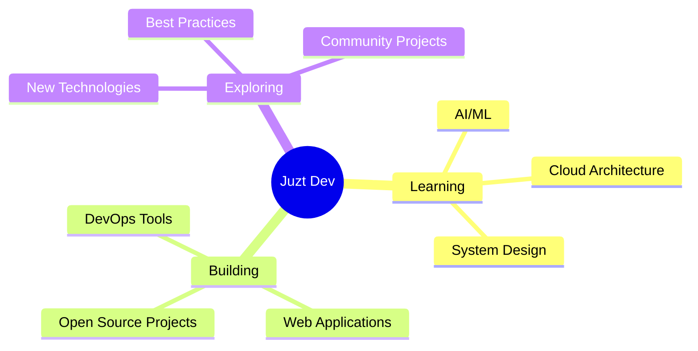

<div align="center">
  
<!-- Animated Header -->


<!-- Animated Typing SVG -->
<a href="https://git.io/typing-svg"></a>

<br/>

<!-- Animated GIF or Profile Image -->


</div>

---

## 🚀 About Me

```typescript
const developer = {
    name: "Juzt Dev",
    role: "Full Stack Developer",
    location: "🌍 Building from Anywhere",
    code: ["JavaScript", "TypeScript", "Python", "Java", "C++"],
    technologies: {
        frontEnd: {
            js: ["React", "Next.js", "Vue"],
            css: ["Tailwind", "Bootstrap", "SASS"]
        },
        backEnd: {
            js: ["Node", "Express", "NestJS"],
            python: ["Django", "Flask", "FastAPI"]
        },
        databases: ["MongoDB", "PostgreSQL", "MySQL", "Redis"],
        devOps: ["Docker", "Kubernetes", "AWS", "CI/CD"],
        tools: ["Git", "VS Code", "Postman", "Figma"]
    },
    currentFocus: "Building scalable applications & learning AI/ML",
    funFact: "I debug with console.log() and I'm proud of it! 😄"
};
```

---

## 🛠️ Tech Stack & Tools

<div align="center">

### 💻 Languages


### 🎨 Frontend


### ⚙️ Backend


### 🗄️ Databases


### 🔧 Tools & DevOps


</div>

---

## 📊 GitHub Stats

<div align="center">
  
<!-- GitHub Stats Card with Animation -->

  
<!-- GitHub Streak Stats -->


</div>

<div align="center">
  
<!-- Top Languages Card -->


<!-- GitHub Activity Graph -->


</div>

---

## 🏆 GitHub Trophies

<div align="center">
  
[](https://github.com/ryo-ma/github-profile-trophy)

</div>

---

## 🎯 Current Focus

<div align="center">



</div>

---

## 📫 Let's Connect!

<div align="center">

[](https://github.com/juzt-dev)
[](https://linkedin.com/in/juzt-dev)
[](https://twitter.com/juzt_dev)
[](mailto:contact@juztdev.com)
[](https://juztdev.com)

</div>

---

## 💡 Random Dev Quote

<div align="center">


</div>

---

## 🎮 When I'm Not Coding...

<div align="center">

🎵 **Listening to Music** | 🎮 **Gaming** | 📚 **Reading Tech Blogs** | ☕ **Coffee Enthusiast** | 🏃 **Fitness**

</div>

---

## 📈 Profile Views Counter

<div align="center">
  


</div>

---

<!-- Snake Animation -->
<div align="center">
  
<!-- Note: The snake animation will appear after the first GitHub Actions workflow run -->


</div>

---

<!-- Animated Footer -->


<div align="center">
  
### 🌟 "Code is like humor. When you have to explain it, it's bad." – Cory House

**✨ Thanks for visiting! Let's build something amazing together! ✨**

</div>
